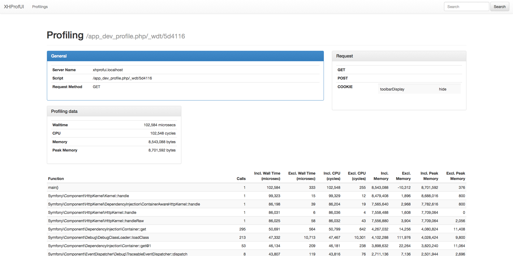

Travis Build: 

## What is XHPROF?

XHPROF is a profiler extension for PHP, originally developed by Facebook and published as open source.

It allows a developer to analyze the performance of a PHP script in great detail.

XHPROF itself can be found at: https://github.com/facebook/xhprof

Documentation: http://uk3.php.net/xhprof

## Why this project?

As XHPROF is a great tool it comes with a basic GUI which just displays one run. The data for the run is stored in files. That's it. If you want to have more functionality and portability of the profiling results you would need to implement it your own.

There are already a few projects which try to optimize the GUI side of XHPROF.

Unfortunately the projects I found and tried are either limited or very hard to adapt to different working environments.

So I decided to start a new project to create a nice clean GUI with the best code quality and flexibility as possible.

With this project I also would like to learn new stuff, so I'll have to find a way to combine both.

The GUI is based on 

 * Symfony2 (https://github.com/symfony/symfony)
 * Doctrine (https://github.com/doctrine/doctrine2)
 * Twig Templating Engine (https://github.com/fabpot/Twig)
 * Bootstrap (https://github.com/twbs/bootstrap)

## GOALS

Provide an integration of XHPROF and a GUI which is

    Clean and easy to use
    Easy to maintain
    Easy to extend
    Easy to install

## Intended Features

    Different Storage Providers (Mysql, Postgres, MongoDB, etc.)
    Multi-Language-Support
    Installer or Package (i.e. PHAR) for easy integration in existing pojects
    As small as possible (but still use existing frameworks and utilities)

## Screenshots

Here I will present some screenshots.

### Profiling page

